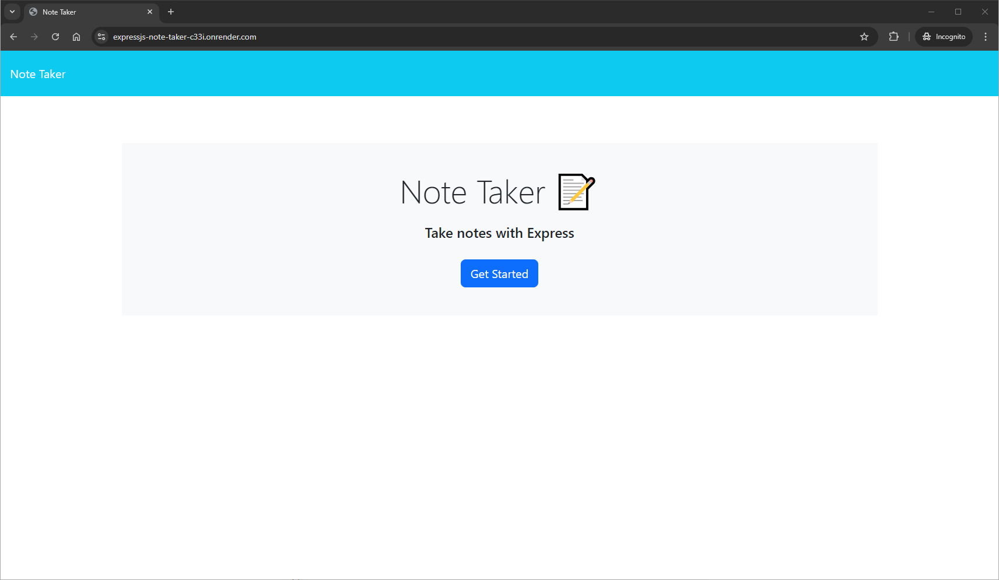
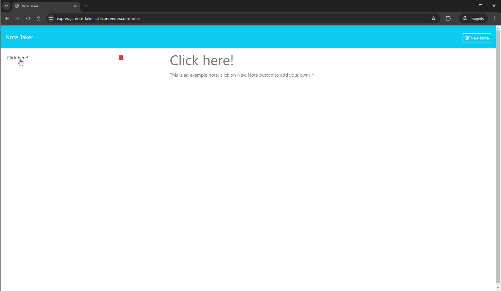
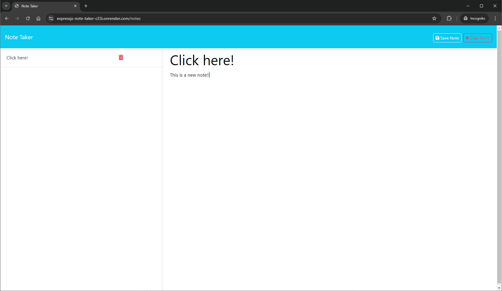

# ExpressJS Note Taker
A web application that allows users to add, view and delete custom notes through user input. Backend data and API endpoints developed using the ExpressJS framework.

This web application can be found here: 

https://expressjs-note-taker-c33i.onrender.com/

## Table of Contents
- [Resources](#resources)
- [Installation](#installation)
- [Usage](#usage)
- [License](#license)
- [Contribution](#contribution)
- [Questions](#questions)
- [Samples](#samples)

## Resources

Outlined below are external and open source resources used to develop this application.

| Resource | Description |
| -------- | ----------- |
| [Bootstrap CDN](https://getbootstrap.com/) | HTML CSS web framework, specifically for front-end |
| [NodeJS](https://nodejs.org/en) | Cross-platform JavaScript runtime environment |
| [bun](https://bun.sh/) | Faster JavaScript runtime environment (npm/yarn alternative) |
| [ExpressJS](https://expressjs.com/) | NodeJS web framework with API and middleware capabilities |
| [generate-unique-id](https://www.npmjs.com/package/generate-unique-id) | npm package designed to generate unique ID strings |


## Installation
This application was written in [NodeJS](https://nodejs.org/en) and [bun](https://bun.sh/) (npm alternative). Please install `Node v20.x` and clone this application to install this application locally.

```shell
# npm
npm i

# bun
bun i
```
  

## Usage
This application is hosted on render.com and can be found here: https://expressjs-note-taker-c33i.onrender.com/. To run this app locally, open a terminal window to the cloned repository and enter in the following commands:

```shell
# npm
npm run start

# bun
bun run start
```
  

## License
[](https://opensource.org/licenses/MIT)

This project is licensed under the [MIT](https://opensource.org/licenses/MIT) license.

## Contribution
To contribute to this application, fork this repository and submit a Pull Request!

## Questions
If you have any questions you can find me on GitHub here: [kevinvongmany](https://github.com/kevinvongmany)
  
You can also contact me via email here: [kevin.vongmany@gmail.com](kevin.vongmany@gmail.com)

## Samples






